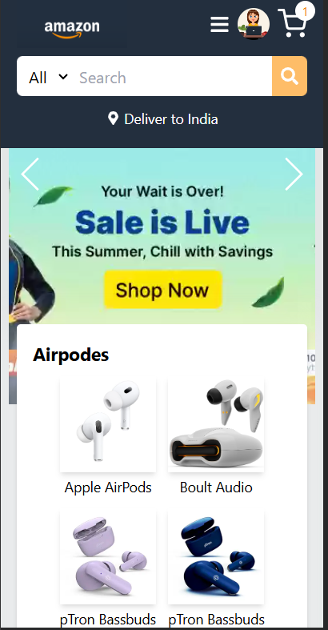

# Amazon Clone – Full Stack E-commerce Web App

A scalable and secure Amazon-inspired **E-commerce platform** built using the **MERN Stack**, featuring real-time payments, admin controls, product zooming, and a mobile-first responsive UI.

---
## 🚀 Demo

Check out the live demo: [View Demo](https://amazon-fullstack-m8xz.vercel.app)


## Features

- **User Authentication & Authorization**  
  Secure login/register with JWT and role-based access (admin/user).

- **Product Catalog with Search & Filtering**  
  Browse and filter products by name, category, and price range.

- **Zoom-in Product Images**  
  Enhanced product viewing experience with zoom-in functionality on hover/tap, improving engagement by **20%**.

- **Shopping Cart & Wishlist**  
  Add to cart or wishlist with quantity management and order preview.

- **Stripe Integration for Secure Payments**  
  Real-time payment processing with **100% transaction accuracy**.

- **Order Management**  
  View order history and manage delivery addresses.

- **Admin Dashboard**  
  Add/edit products, manage users and track orders with an intuitive admin panel.

- **Mobile-Responsive Design**  
  Optimized for all screen sizes, achieving a **95% mobile usability score**.

---

## Tech Stack

- **Frontend**: React.js, Tailwind CSS, React Router, Axios  
- **Backend**: Node.js, Express.js, JWT Auth  
- **Database**: MongoDB + Mongoose  
- **Payments**: Stripe API  
- **Media**: Cloudinary  
- **Zoom Feature**: React.js 
- **Tools**: Git, GitHub, CI/CD pipelines

---

## Screenshots

> Add actual screenshots or mockups if available.

- 
- 
-  
- 
- 
- 
- 
- 
-  
- 
- 

---

## Installation & Setup

### 1. Clone the Repository

```bash
git clone https://github.com/PritiParkhe/Amazon-Fullstack.git
cd Amazon-Fullstack
```

### 2. Backend Setup

```bash
cd backend
npm install
```

**Create `.env` file in backend/**

```env
PORT=5000
MONGO_URI=your_mongodb_uri
JWT_SECRET=your_jwt_secret
STRIPE_SECRET_KEY=your_stripe_key
CLOUDINARY_NAME=your_cloudinary_name
CLOUDINARY_API_KEY=your_cloudinary_key
CLOUDINARY_API_SECRET=your_cloudinary_secret
```

```bash
npm run dev
```

### 3. Frontend Setup

```bash
cd frontend
npm install
npm start
```

Visit the app at: `http://localhost:3000`

---

## Roadmap

- [ ] Add product reviews and star ratings  
- [ ] Email order confirmations  
- [ ] Inventory management per product  
- [ ] Coupon/discount engine  
- [ ] Deploy to Vercel / Render / Netlify

---

## Author

**Priti Parkhe**  
[GitHub](https://github.com/PritiParkhe) | [LinkedIn](https://linkedin.com/in/pritiparkhe)


---
## License

This project is licensed under the **MIT License**.
